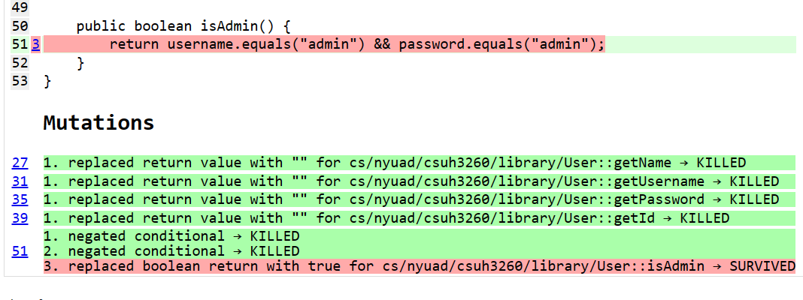

# Library Management System

A Library Management System designed to facilitate the management of books and users in a library setting for CS UH-3260 assignments on Advanced Testing. 

#### Group Name: `Group 8`
#### Group Members
1. Zulfkhar Maukey
2. Tuqa Abdelnasir
3. Ramsha Bilal

## Goal 
The goal of the Library Management System is to provide an efficient and user-friendly platform for managing books and users within a library environment. It aims to streamline processes such as book search, reservation, and return, while also facilitating administrative tasks such as adding new books, managing book inventory, and user authentication.

## Features
- User Authentication: Secure login and signup for admin and regular users.
- Book Management: Add, remove, and update book inventory.
- Search Functionality: Quick keyword-based book search.
- Reservation System: Reserve books for borrowing.
- Book Borrowing and Return: Borrow and return books seamlessly.
- Database Management: Utilize MongoDB for secure data storage.
- User-Friendly Interface: Intuitive commandline interface for easy interaction.

1. `User`: Manages user information and authentication.
2. `Book`: Handles book details and information.
3. `DatabaseManager`: Manages interactions with the database for users and books.
4. `SystemManager`: Controls system functionality, including user operations and book management.

## Tools & Technologies
- Language of implementation: `Java`
- Framework for Unit Testing: `JUnit`
- Framework for Mocking: `Mockito`
- Framework for Mutation Testing: `Pitest`
- Code Coverage Tool: `Jacoco`
- External database: `MongoDB`

## Instructions
### Prerequisites
1. Java Development Kit (JDK) installed on your machine.
2. Maven

### Compilation & Running
1. Navigate to the root directory of this project where the pom.xml file is located:
```
cd path/to/your/project/root
```
2. Compile your project using Maven:
```
mvn clean compile
```
3. Run the program using the following command:
```
mvn exec:java -Dexec.mainClass="cs.nyuad.csuh3260.library.SystemManager"
```

## Achieved statement and branch coverage 


## Achieved mutation score

To run PITest using Maven to calculate mutation score:
```
mvn org.pitest:pitest-maven:mutationCoverage
```
After running PITest, the mutation testing report files are generated in the `target` directory. Look for a directory named `pit-reports` within the `target` directory. View `index.html` inside this directory in browser to see the report.

### Initial Mutation Score


## Initially Live Mutants

Example 1: Mutant in isAdmin() Method in User Class


#### Initial Live Mutant: 
The mutation replaced the boolean return with true for the isAdmin method.
#### Initial Test Suite: 
The initial test suite did not cover the scenario where the isAdmin method should return false for non-admin users.
#### Improvement to Test Suite: 
A new test case was added to cover this scenario by creating a user with a non-admin username and password and asserting that the isAdmin method returns false for this user. This test case effectively killed the mutant by detecting the incorrect behavior introduced by the mutation. 

Example 2: Mutant in login() Method in SystemManager class


#### Initial Live Mutant: 
The mutant removed print statement.
#### Initial Test Suite: 
The initial test suite did not verify that `System.out` should print according message.
#### Improvement to Test Suite: 
Additional verify() method was added to check for the print to be executed.

Example 3: Mutant in signup() Method in SystemManager class


#### Initial Live Mutant: 
The mutant removed print statement.
#### Initial Test Suite: 
The initial test suite did not verify that `System.out` should print according message.
#### Improvement to Test Suite: 
Additional verify() method was added to check for the print to be executed.

## Static Analysis Tools Results
[Link to My Report](report.md)

